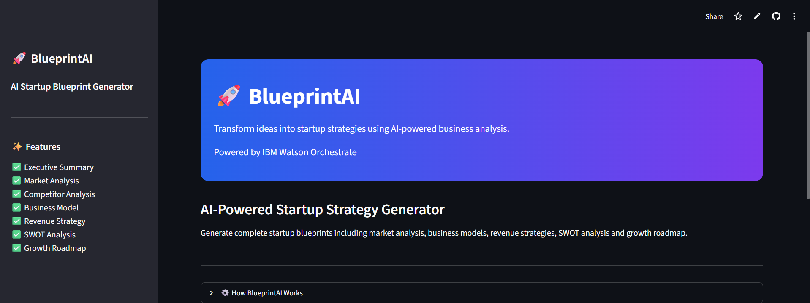
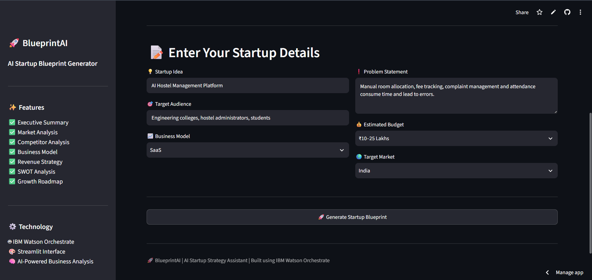
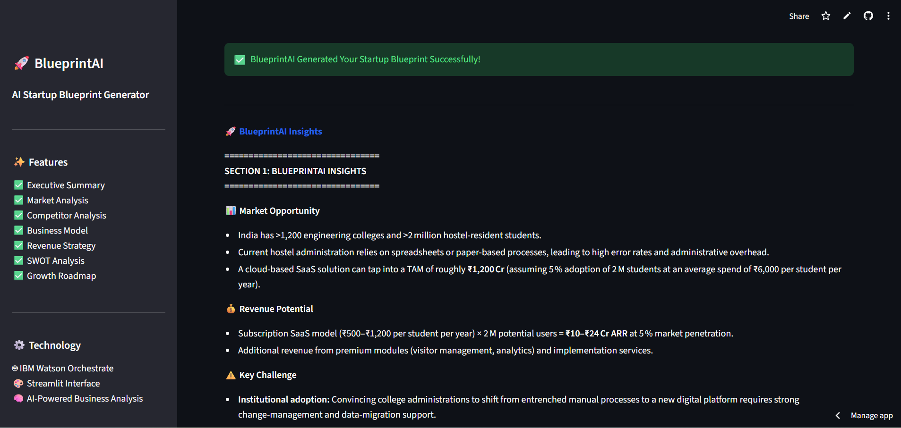

# 🚀 BlueprintAI

🔗 **Live Demo:** https://blueprintai-amvvuyedzdwhhknpeagft8.streamlit.app
**BlueprintAI** is an AI-powered Startup Blueprint Generator that transforms startup ideas into comprehensive business plans using **IBM Watson Orchestrate**.

Instead of spending hours researching markets, competitors, business models, and funding options, users simply enter their startup details and receive a complete AI-generated startup blueprint.

---

# Features

- 🚀 AI-powered startup blueprint generation
- 📊 Market analysis
- 🏢 Competitor analysis
- 💰 Revenue model recommendations
- 📈 Business model strategy
- ⚠️ SWOT analysis
- 🛣️ Development roadmap
- 💵 Funding opportunities
- 🎯 Actionable next steps
- 💡 AI-generated startup insights

---

#  Technology Stack

| Technology | Purpose |
|------------|---------|
| Python | Backend Logic |
| Streamlit | Web Interface |
| IBM Watson Orchestrate | AI Agent |
| IBM IAM | Authentication |
| Requests | API Communication |

---

#  System Architecture

```text
                User
                  │
                  ▼
      Streamlit Web Interface
                  │
                  ▼
      Startup Details Form
                  │
                  ▼
        Prompt Construction
                  │
                  ▼
  IBM Watson Orchestrate Agent
                  │
                  ▼
      AI Startup Blueprint
                  │
                  ▼
      BlueprintAI Interface
```

---

#  How It Works

1. Enter your startup details.
2. Click **Generate Startup Blueprint**.
3. BlueprintAI sends the request to IBM Watson Orchestrate.
4. The AI agent analyzes the startup idea.
5. A complete startup blueprint is generated and displayed.

---

# 📁 Project Structure

```text
BlueprintAI/
│
├── app.py
├── orchestrate_client.py
├── config.py
├── requirements.txt
├── discover_agents.py
├── chat_with_agent.py
├── test_connection.py
├── README.md
└── .env (Not uploaded to GitHub)
```

---

#  Installation

## 1. Clone the Repository

```bash
git clone https://github.com/AdaGupta11/BlueprintAI.git
```

## 2. Move into the Project Folder

```bash
cd BlueprintAI
```

## 3. Install Required Libraries

```bash
pip install -r requirements.txt
```

## 4. Create a `.env` File

Add your IBM Watson Orchestrate API Key:

```text
ORCHESTRATE_IAM_APIKEY=YOUR_API_KEY
```

## 5. Run the Application

```bash
streamlit run app.py
```

---

# 📸 Screenshots

## 🏠 Home Page



## 📝 Startup Input Form



## 🚀 Generated Startup Blueprint



---

#  Security

Sensitive credentials such as the IBM IAM API Key are stored securely using environment variables (`.env`) and are **not included** in the GitHub repository.

---

#  Future Enhancements

- 📄 Export blueprint as PDF
- 📑 Export blueprint as DOCX
- 📊 Financial forecasting
- 🎤 AI-generated investor pitch deck
- 📈 Startup readiness score
- 🌍 Multi-language support
- 💬 Conversational AI startup advisor

---

#  Developer

**Ada Gupta**

B.Tech – Computer Science & Engineering

Built using **IBM Watson Orchestrate** and **Streamlit**.

---

#  License

This project has been developed for educational and learning purposes.
